# CheatSheet.md

# Table of Contents
- [Getting Data](#getting-data)
  - [CSV file](#csv-file)
  - [Excel file](#excel-file)
  - [Table on webpage](#table-on-webpage)
  - [Google Sheet](#google-sheet)
- [Thinking about the Data](#thinking-about-the-data)
  - [What columns are there?](#what-columns-are-there)
  - [What's at the top of the data?](#whats-at-the-top-of-the-data)
  - [What's at the bottom of the data?](#whats-at-the-bottom-of-the-data)
- [Cleaning the data](#cleaning-the-data)
  - [Deleting rows](#deleting-rows)
  - [Fixing a multi-index](#fixing-a-multi-index)
  - [Renaming Columns](#renaming-columns)
- [Plotly Express](#plotly-express)
  - [Import the library](#import-the-library)
  - [Bar chart](#bar-chart)
  - [Comparison Operators](#comparison-operators)

# Getting Data

## CSV file

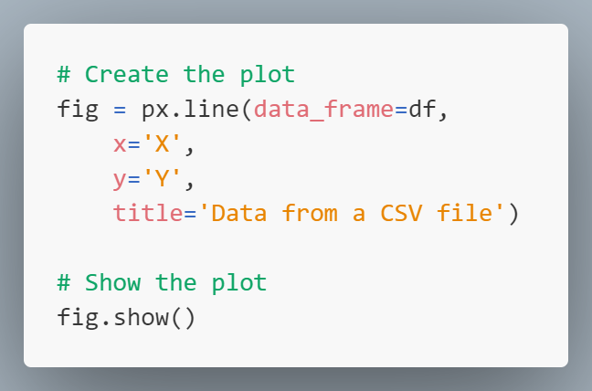

## Excel file

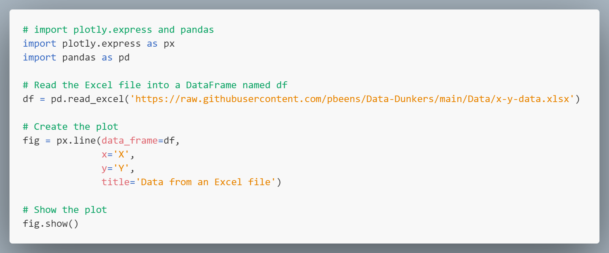

## Table on webpage

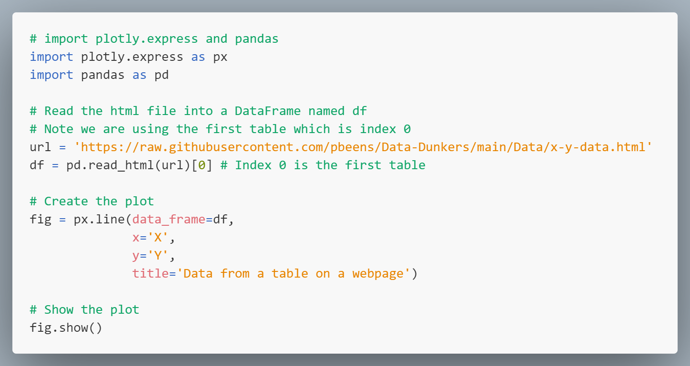

## Google Sheet

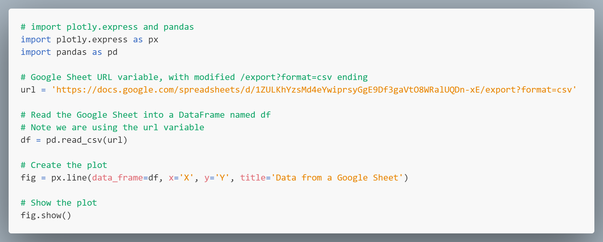

# Thinking about the Data

## What columns are there?

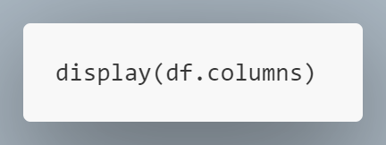

## What's at the top of the data?

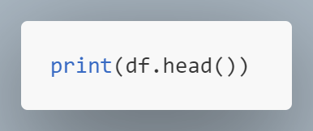

## What's at the bottom of the data?

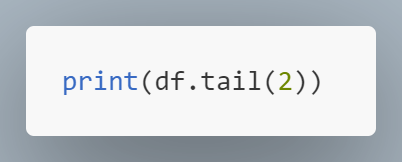

# Cleaning the data

## Deleting rows

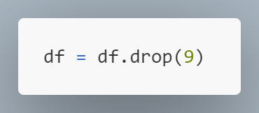

## Fixing a multi-index

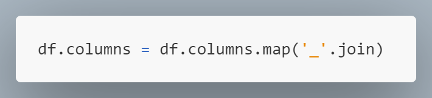

## Renaming Columns

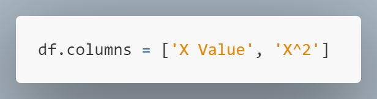

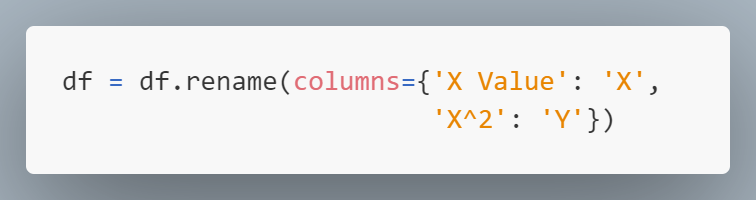

# Plotly Express

Here are some cheat sheets or tutorials that might also help you. 

+ [kdnuggets.com](https://www.kdnuggets.com/publications/sheets/Plotly_Express_for_Data_Visualization_Cheat_Sheet_KDnuggets.pdf) (PDF)
+ [towardsdatascience.com](https://towardsdatascience.com/cheat-codes-to-better-visualisations-with-plotly-express-21caece3db01) 
+ [franzdiebold.github.io](https://franzdiebold.github.io/plotly-express-cheat-sheet/Plotly_Express_cheat_sheet.pdf) (PDF) (Also available in [Colab](https://colab.research.google.com/github/FranzDiebold/plotly-express-cheat-sheet/blob/main/plotly-express-cheat-sheet.ipynb))
+ [franzdiebold.github.io](https://images.franzdiebold.github.io/image/upload/v1668605954/Marketing/Blog/Plotly_Cheat_Sheet.pdf) (PDF)

## Import the library

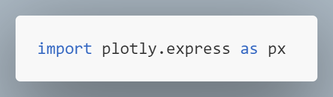

## Bar chart

## Comparison Operators

|Symbol|Meaning|
|-|-|
|>|greater than|
|<|less than|
|==|is equal to|
|!=|not equal to|
|>=|greater than or equal to|
|<=|less than or equal to|
|&|and|
|\||or|